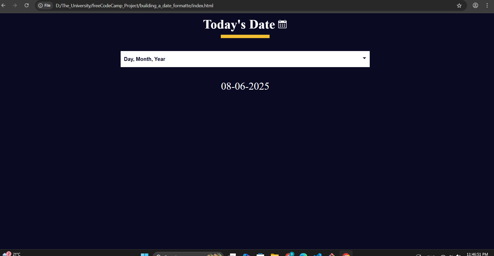

# 📅 Date Format Converter

## 📖 About
A simple and intuitive **Date Format Converter** that allows users to convert dates between various formats.  
Built to practice **JavaScript date manipulation** and enhance skills with **DOM interactions and form handling**.

## 🎨 Features
- 📆 Convert dates between multiple formats
- 🔄 Real-time conversion on button click
- ✨ Clean and responsive design
- 💻 Interactive form with accessible labels and placeholders
- 📝 Clear input validation and feedback messages (planned)

## 🛠️ Technologies Used
- HTML5
- CSS3
- JavaScript (Vanilla)

## 📸 Screenshot

## 🌐 Live Demo
👉 [View it Live on GitHub Pages](https://al-azaki.github.io/Date-Format-Converter/)

## 🚀 How to Use
1. Enter a date in the input field (e.g., `2025-06-08`).
2. Select your preferred output format from the dropdown.
3. Click the **Convert** button.
4. View your converted date instantly below the form!

## 💡 Key Learnings
While building this project, I strengthened my skills in:
- Working with **JavaScript Date objects**
- Handling form inputs and events dynamically
- Updating DOM elements based on user interaction
- Managing different date formats and conversions

## 📈 Next Steps
- [ ] Add more regional date format options
- [ ] Implement input validation and error messages
- [ ] Enhance mobile UX with better spacing and layout adjustments

## ✨ Author
**Bashir Al-Azaki**  
[LinkedIn](https://ye.linkedin.com/in/bashir-al-azaki-423453356) | [GitHub](https://github.com/AL-Azaki)

---

## 📌 Note for Reviewers & Fellow Developers:
This project was part of my ongoing learning journey, and every line was **hand-coded by me** while practicing JavaScript fundamentals.  
I believe in learning by building — and I welcome feedback or suggestions for improvements. Feel free to reach out or open an issue if you spot something that could be enhanced!
